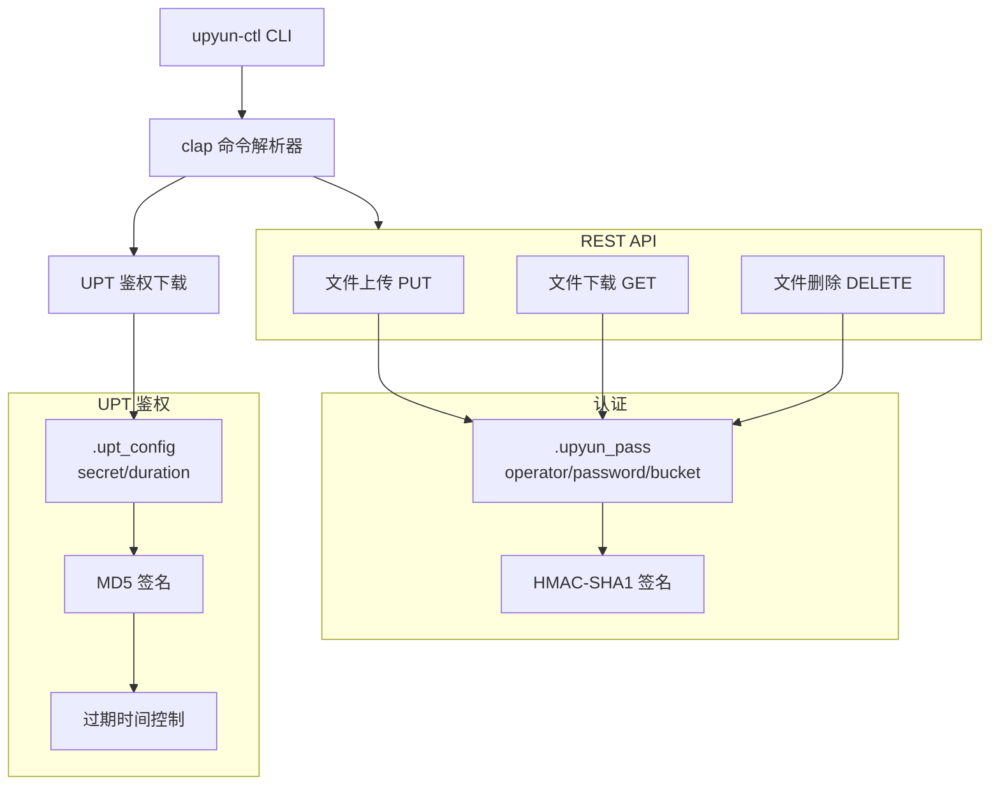
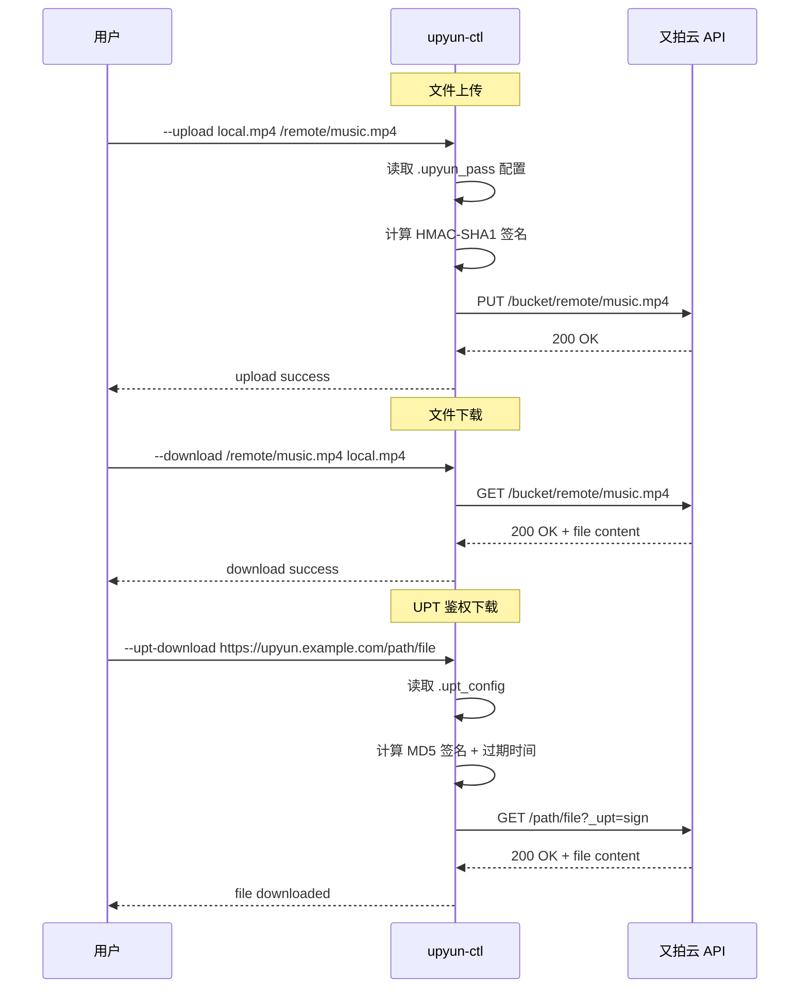

# upyun-ctl

又拍云 (Upyun) 对象存储 CLI 工具。支持文件上传、下载、删除以及 UPT 鉴权下载。

## 架构



## 数据流



## 功能

| 命令 | 说明 | 鉴权方式 |
|------|------|---------|
| `--upload <remote> <local>` | 上传本地文件到又拍云 | REST API (HMAC-SHA1) |
| `--download <remote> <local>` | 从又拍云下载文件 | REST API (HMAC-SHA1) |
| `--delete <remote>` | 删除又拍云上的文件 | REST API (HMAC-SHA1) |
| `--upt-download <url>` | 通过 UPT 鉴权方式下载 | UPT (MD5 + 时间戳) |

## 安装

### 编译安装

```bash
# 在 AuthCore 项目根目录
cargo build -p upyun_tool --release

# 安装到系统路径
sudo cp target/release/upyun_tool /usr/local/bin/upyun-ctl
```

或使用安装脚本：

```bash
# 在 AuthCore 仓库上级目录
sh upyun_tool/install_release_to_usr_local.sh
```

## 配置

### REST API 配置 (`.upyun_pass`)

创建配置文件，每行一个字段：

```text
your_operator_name
your_operator_password
your_bucket_name
```

### UPT 配置 (`.upt_config`)

```text
your_upt_secret
3600
```

第二行为 UPT 链接的有效时长（秒）。

## 使用示例

### 上传文件

```bash
upyun-ctl --upload /local/path/video.mp4 /remote/path/video.mp4 --server 1
```

### 下载文件

```bash
upyun-ctl --download /remote/path/video.mp4 /local/path/video.mp4 --server 1
```

### 删除文件

```bash
upyun-ctl --delete /remote/path/video.mp4 --server 1
```

### UPT 鉴权下载

```bash
upyun-ctl --upt-download https://upyun.alchemy-studio.cn/music-room/video.mp4
```

`--server` 参数指定又拍云 API 节点编号（默认为 0，对应 `v0.api.upyun.com`）。

## 认证方式

### REST API (HMAC-SHA1)

1. 对 operator password 做 MD5 得到 `md5_password`
2. 以 `md5_password` 为 HMAC key，对 `METHOD&/bucket/uri&DATE` 做 HMAC-SHA1
3. 将结果 Base64 编码，构造 `Authorization: UPYUN operator:signature` 请求头

### UPT (MD5 + 时间戳)

1. 构造待签名字符串 `secret&end_time&uri`
2. 对该字符串做 MD5
3. 取 MD5 结果第 12-20 位，拼接 `end_time` 得到 `_upt` 参数
4. 追加到 URL 上请求
